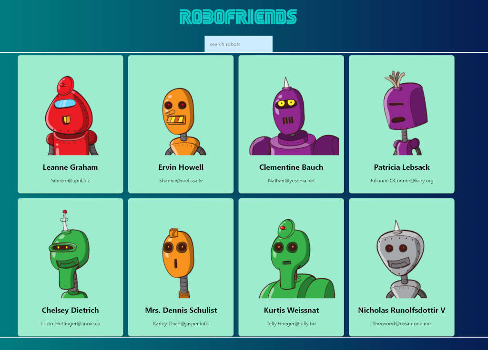

React app created to allow users to search for provided robot repository by name.
Responsive class-based Create-React-App that uses RoboHash JSON hash / mock API. 
Tachyons NPM package implemented for CSS styling.
App created alongside Zero to Mastery Complete Web Developer course

